# 体系结构

## 计算机网络概念
计算机网络(Computer networking)是一个将众多`分散的`、`自治的`计算机系统，通过`通信设备`与`线路`连接起来，由功能完善的`软件`实现`资源共享`和`信息传递`的系统。 

### 计算机网络的组成和功能
组成
- 从组成部分看：

- 从工作方式看：

- 从逻辑功能看：

计算机网络的功能

### 数据交换
1. 电路交换

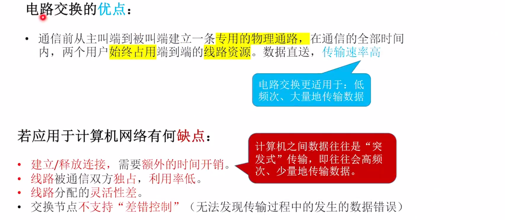

2. 报文交换

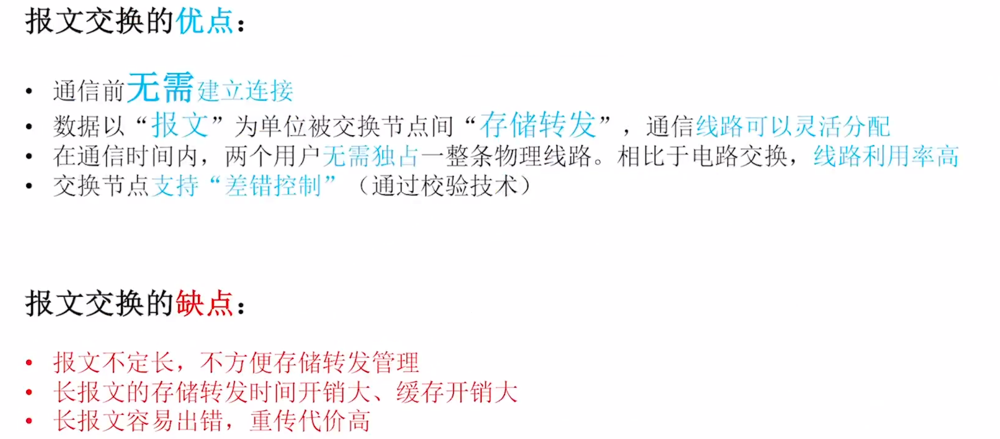

3. 分组交换

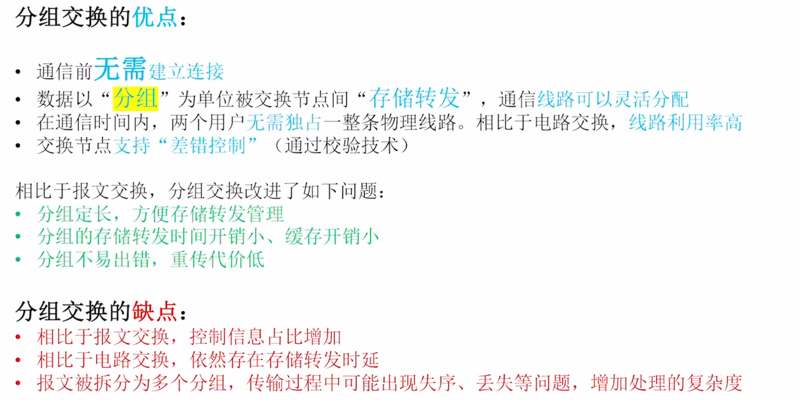

### 三种方式的性能比较
要能看懂下面的图：

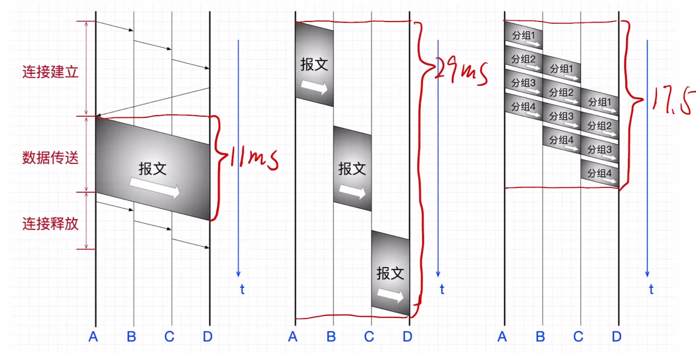

对比：

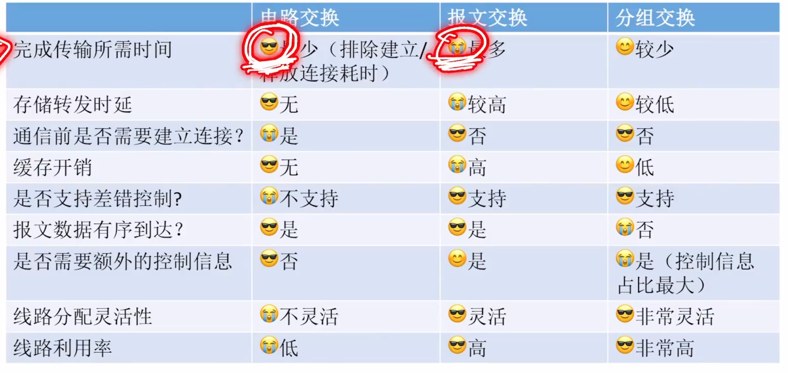

### 计算机网络的分类
1. 按分布范围分类

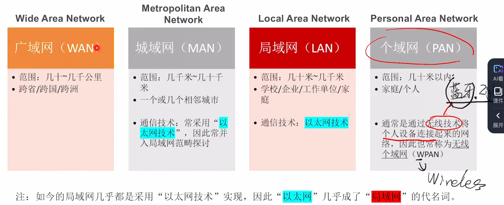

2. 按传输技术分类

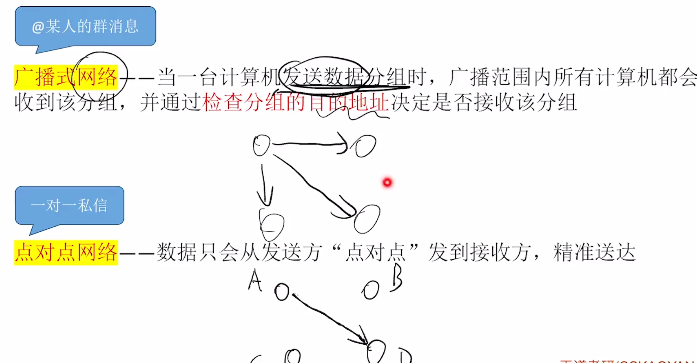

3. 按拓扑结构分类（逻辑上呈现出的形式）
- 总线形：存在`总线争用`问题，广播式传输（常见于局域网 如集线器连接的设备）
- 环形：用令牌解决`总线争用`问题，广播式传输（常见于局域网）
- 星形：不存在`总线争用`问题，由中央设备实现，点对点传输（常见于局域网 如交换机连接的设备）
- 网状：灵活、可靠性高、控制复杂、线路成本高（常见于广域网）

4. 按使用者分类
公用网、专用网

5. 按传输介质分类
有线网络、无线网络

### 计算机网络性能指标
`速率、带宽和吞吐量`

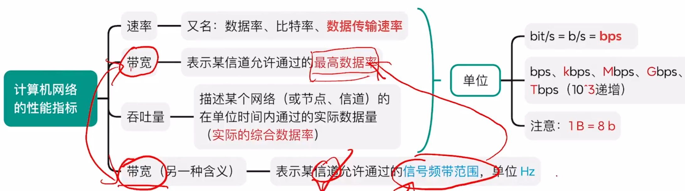

`时延 = 发送时延（传输时延） + 传播时延 + 处理时延 + 排队时延` 
`时延带宽积 = 单向传播时延 * 带宽` 
`往返时延RTT = 从`发送方发送完数据`（即不考虑发送时延），到发送方`收到`来自接收方的确认，总共经历的时间` 
`信道利用率 = 有数据通过该信道的时间 / (有数据通过该信道的时间 + 空闲时间)` 

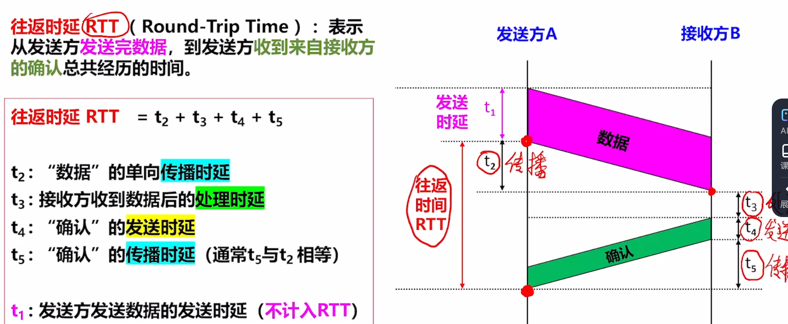

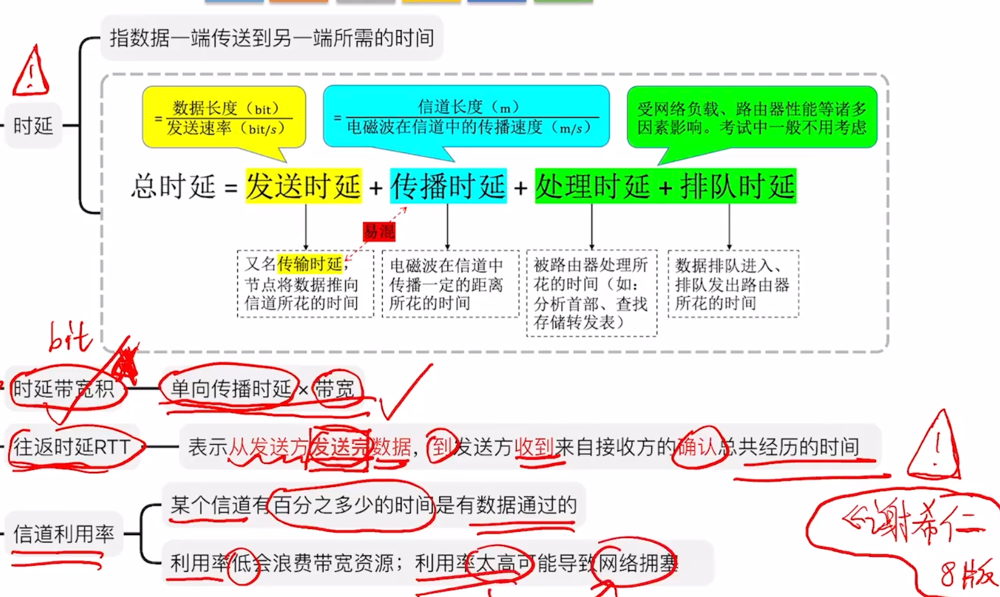

**⚠️一些概念和错题知识点整理** 
- `拓扑结构`主要指`通信子网`的拓扑结构
- 是否采用`分组存储转发`与`路由选择机制`是`点对点`式网络和`广播式`网络的重要区别，`广域网基本都属于点对点网络`
- 对于`高速链路`，提高的仅仅是`数据发送速率`而非比特在链路上的传播速率。提高数据的发送速率只是为了`减少数据的发送时延`
- `广播式网络可以不需要网络层`
- `分组交换网络的附加信息开销大`

---

## 计算机网络的分层结构
OSI七层参考模型（法律标准）：由ISO提出，可能有不同层做相同的事（应用层、表示层、会话层、运输层、网络层、数据链路层、物理层） 
TCP/IP四层模型（事实标准）：阿帕网项目的成果，每一层做的事都不一样（应用层、传输层、网际层、网络接口层） 
五层模型（教学用）：每一层做的事都不一样（应用层、运输层、网络层、数据链路层、物理层） 

网络体系结构： 
是计算机的`各层及其协议的集合`，指这个计算机网络及其构件所应完成的`功能的精确定义`（不涉及实现） 
实现：遵循这种体系结构的前提下，用何种硬件或软件完成这些功能的问题 

各层之间的关系： 
实体：在计算机网络的分层结构中，第n层中的活动元素（软件+硬件）通常称为第n层实体。不同机器上的同一层称为`对等层`，同一层的实体称为`对等实体` 
协议：即网络协议(Network Protocol)，，是控制对等实体之间进行通信的规则的集合，`是水平的` 
接口：即同一节点内`相邻两层的实体`交换信息的`逻辑接口`，又称为`服务访问点` 
服务：服务是指`下层为紧邻的上层`提供的功能调用，它是`垂直的` 

数据传输过程

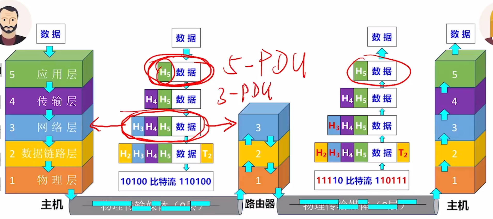

PCI、SDU、PDU概念 
（P+S=P=下一层S）

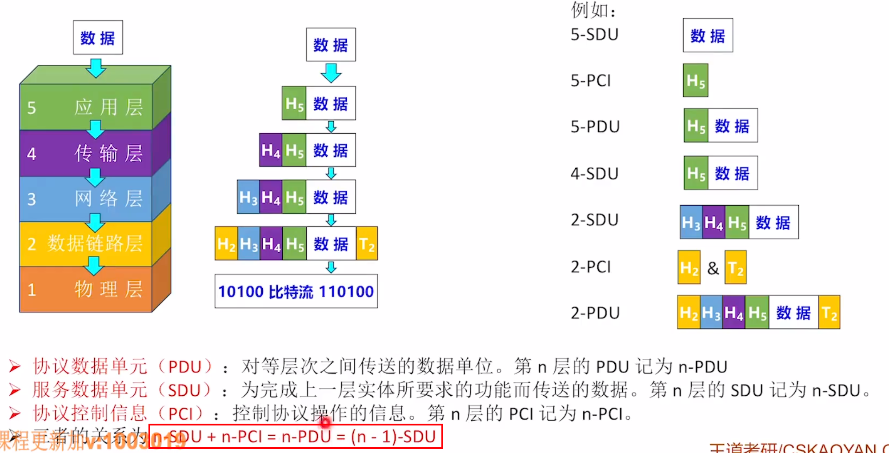

协议的三要素

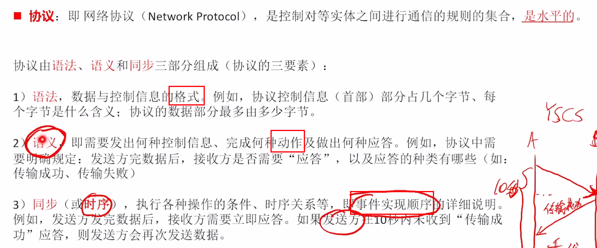

## OSI参考模型
`物联网叔会使用`

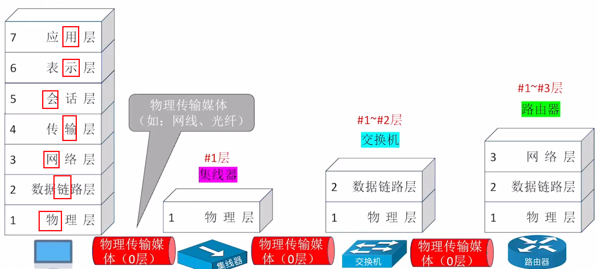

各层功能：

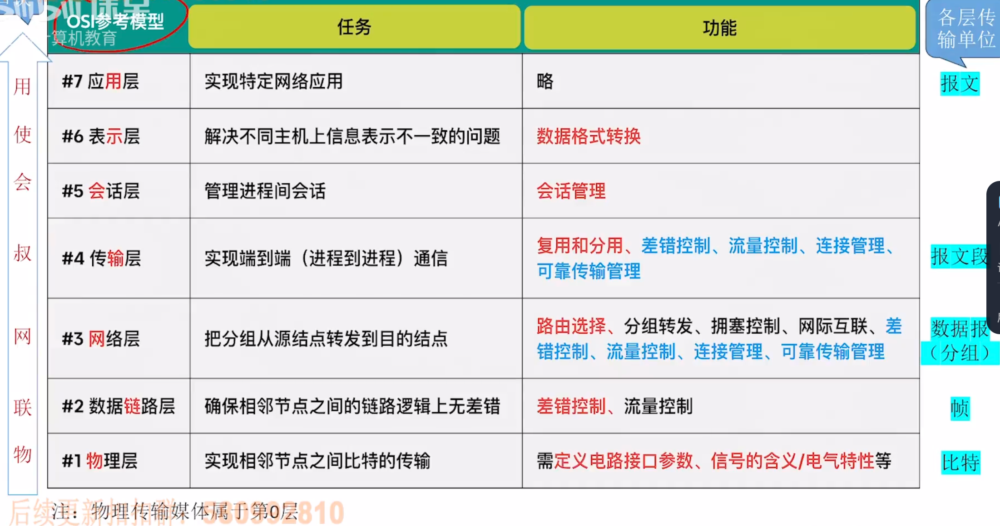

## TCP/IP模型
与OSI参考模型对比

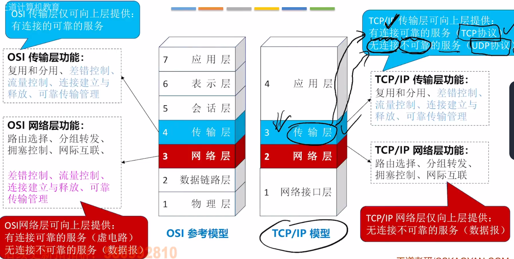

各层功能：

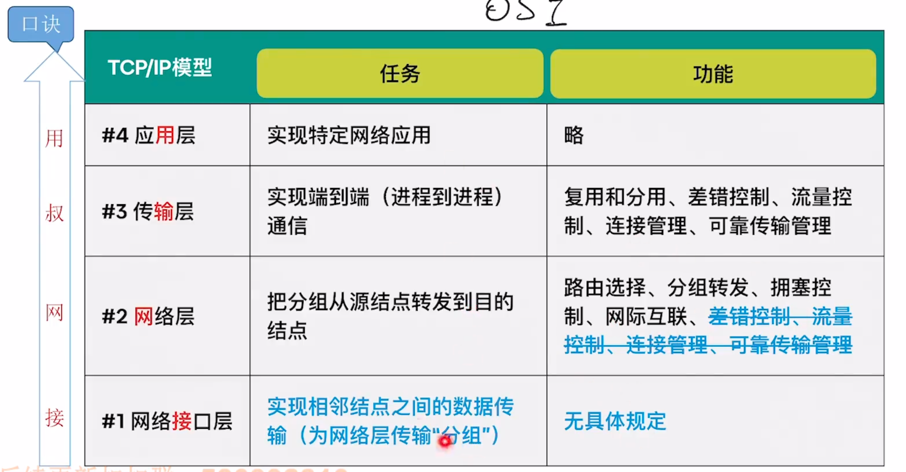

**⚠️一些概念和错题知识点整理** 
- 第n层的实体不仅要使用第n-1层的服务来实现自身定义的功能，还要向第n+1层提供本层的服务，`该服务是第n层及其下面各层提供的服务总和`
- 上一层只能通过相邻层间的接口使用下一层的服务，`而不能调用其他层的服务`；下一层所提供的服务的实现细节`对上一层透明`
- `定义功能执行的方法不是对网络模型进行分层的目标`
- 只有`应用层和物理层不额外附加消息`
- `提供建立、维护、拆除端到端`的连接的层是`传输层`

问：协议与服务有何区别？有何联系？ 
- 协议是控制两个对等实体之间通信的规则的集合。在协议的控制下，两个对等实体间的通信使得本层能够向上一层提供服务， 而要实现本层协议，还需要使用下一层提供的服务。
- 协议和服务概念的区分:
  - 协议的实现保证了能够向上一层提供服务。本层的服务用户只能看见服务而无法看见下面的协议，即下面的协议对上面的服务用户是透明的。
  - 协议是“水平的”，即协议是控制两个对等实体之间的通信的规则。但服务是“垂直的”，即服务是由下层通过层间接口向上层提供的。
