# 物理层

## 通信基础的基本概念

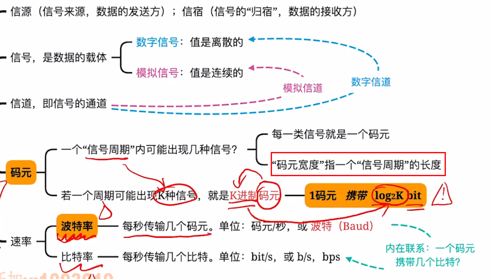

## 信道的极限容量
信道没有噪声 -> 奈奎斯特定理
信道有噪声 -> 香农定理

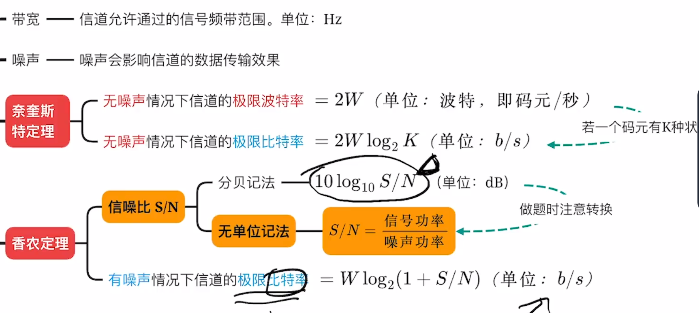

奈氏准则例题：

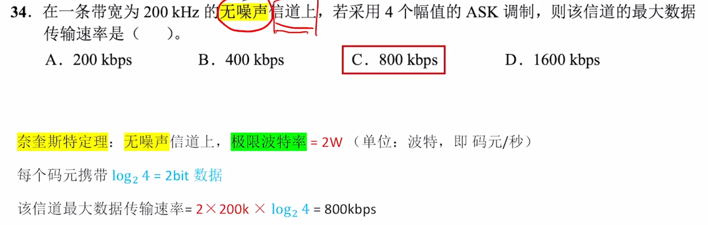

香农定理例题：

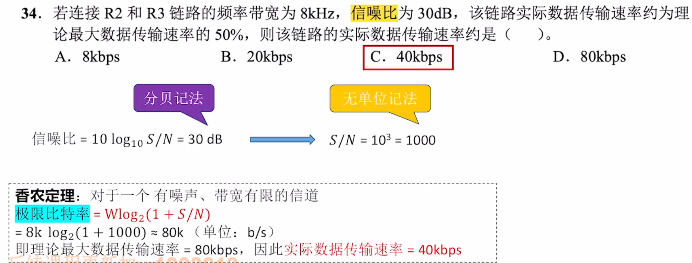

## 编码与调制

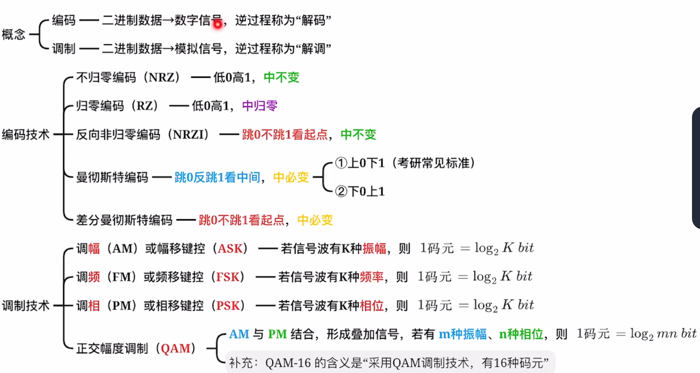

五种编码：

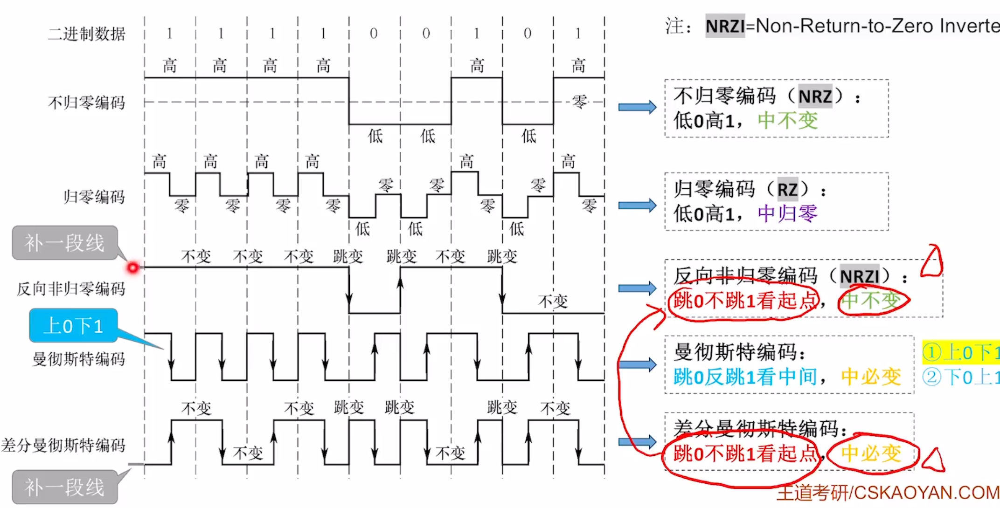

如何区分曼彻斯特编码和差分曼彻斯特编码？ 
两种编码都是“中必变”，如果中间跳变方向和二进制能对应就是曼彻斯特编码；如果虚线处的跳变能和二进制对应就是差分曼彻斯特编码，同时还有一段开始的虚线 

对比：

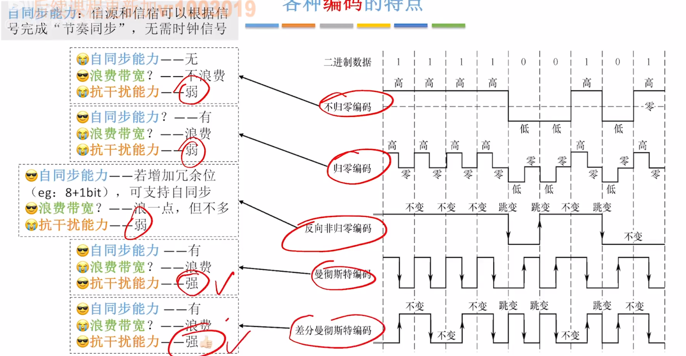

例题（选A）：

例题（选A）：

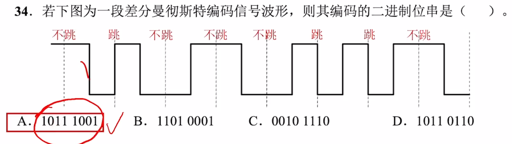

常见调制：

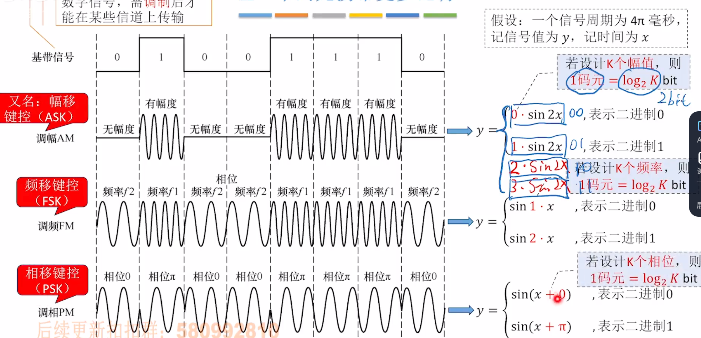

例题：

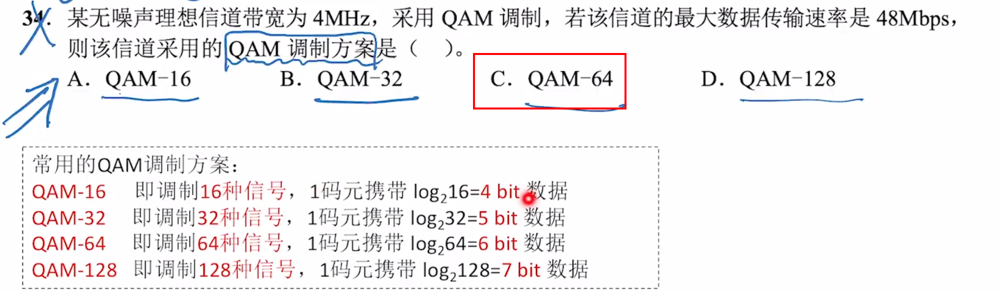

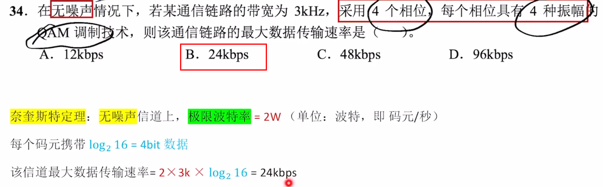

**⚠️一些概念和错题知识点整理** 
- `码元速率`与`进制数`无关，与`码元宽度`有关
- 码元`传输速率`也称`调制速率、波形速率、符号速率`
- `信号传播速度不会影响信道数据传输速率`

---

## 传输介质
有线：双绞线、同轴电缆、光纤 
无线：无线电波、微波 

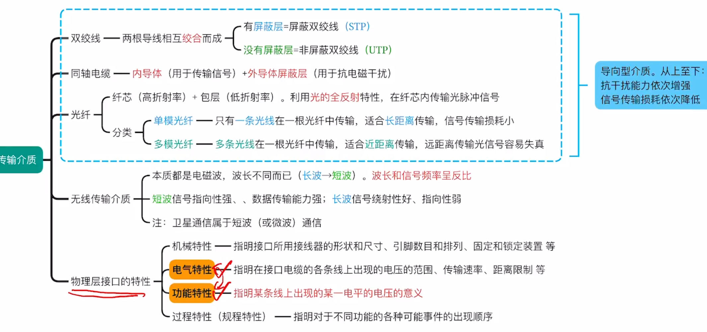

以太网对有线传输介质的命名：

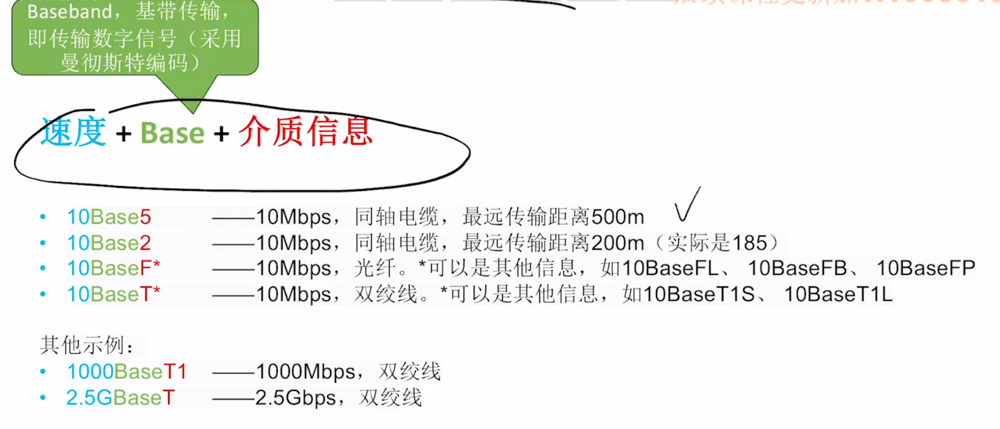

**⚠️一些概念和错题知识点整理** 
- `以太网`采用`广播方式`发送信息，因此`主机间的通信方式是半双工`
- `如果光纤直径减小到只有光的一个波长大小，那么光沿直线传播`

---

## 物理层设备
中继器、集线器（不能隔绝冲突域）

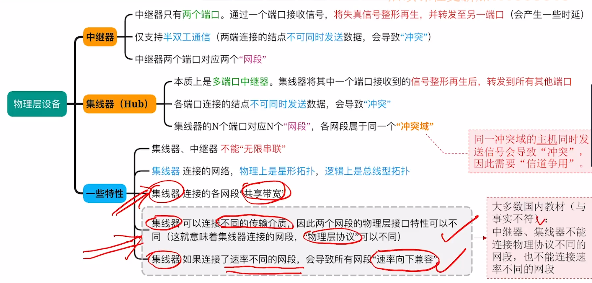

**⚠️一些概念和错题知识点整理** 
- 如果某个网络设备具有存储转发的功能，那么可以认为它能连接两个不同的协议
- 互联串联的物理层设备不能超过4个，5个网段，3个地方挂载计算机——5-4-3规则（不用背，了解）
- `Hub只能在半双工状态下工作`
- `物理层设备不能分割冲突域，共享网络带宽`
- 一般来说，`集线器`连接的网络在拓扑结构上属于`星型`
- 集线器的端口收到一个数据后，将其从`除输入端外的端口广播出去`
