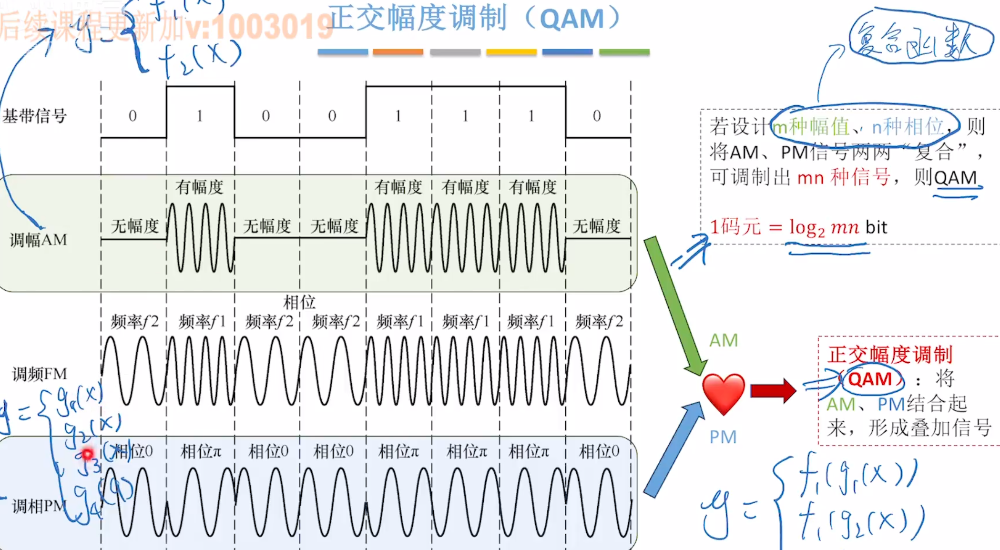

# 物理层

## 通信基础的基本概念

## 信道的极限容量
信道没有噪声 -> 奈奎斯特定理
信道有噪声 -> 香农定理

奈氏准则例题：

香农定理例题：

## 编码与调制

五种编码：

如何区分曼彻斯特编码和差分曼彻斯特编码？ 
两种编码都是“中必变”，如果中间跳变方向和二进制能对应就是曼彻斯特编码；如果虚线处的跳变能和二进制对应就是差分曼彻斯特编码，同时还有一段开始的虚线 

对比：

例题（选A）：

例题（选A）：

常见调制：

例题：

