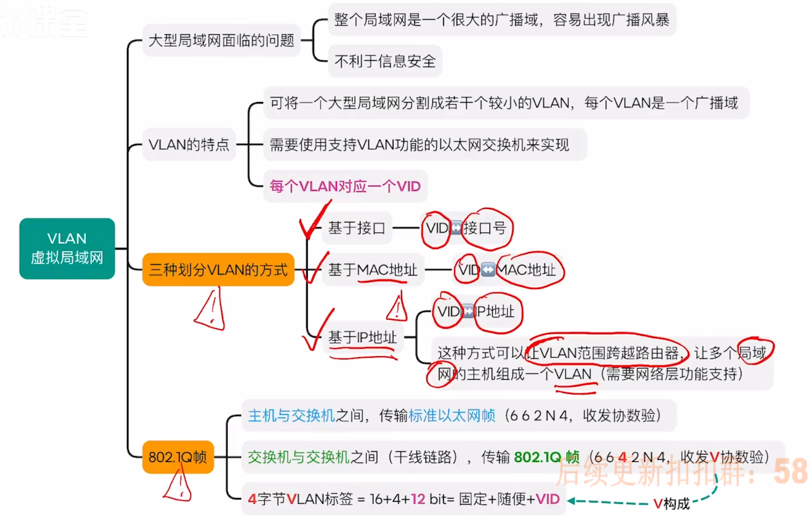

# 数据链路层

## 数据链路层的功能

**⚠️一些概念和错题知识点整理** 
数据链路层协议的功能包括：`定义数据格式（组帧）`、`提供节点之间的可靠传输`、`控制对物理传输介质的访问`

---

## 组帧
`字符计数法、字节填充法、零比特填充法、违规编码法`

## 差错控制
### 检错编码（奇偶校验码）
奇校验：在信息为前添加1或0，使得整个信息的二进制表示中1的个数为奇数个 
偶校验（常用，使用模2加就可求得应该添加的校验位）：在信息为前添加1或0，使得整个信息的二进制表示中1的个数为偶数个 
模2加：信息位依次进行异或运算，所求结果就是偶校验位 

### 检错编码（循环冗余校验码）
信息位K位、校验位R位

### 纠错编码（海明码）

分组偶校验的由来：每一个校验位都代表所有信息位每一位分组的权重：

纠错（S由下标从大到小排序做成的数字为出错的海明码位）

信息位由下标从大到小或从小到大排序的不同做法：

`一位纠错能力`和`两位检错能力`无法区分需要添加全校验位进行偶校验（如果是两位错了需重传）：

---

## 流量控制与可靠传输机制
### 流量控制、可靠传输与滑动窗口机制

### 停止等待协议（S-W）
发送方发送Data0（数据帧） -> 接收方接受到，进行差错控制 -> 接收方返回ACK0（确认帧），同时滑动窗口向后移一位 -> 发送方收到ACK0后，滑动窗口后移一位，然后发送Data1 

- 滑动窗口机制：发送窗口Wt和接收窗口Wr都为1
- 帧编号：只需1bit（即编号为0101010101，两方滑动窗口距离不超过1因此用1bit足矣），要求Wt+Wr<=2^n
- 确认机制：确认帧ACK_i，接收方收到i号帧，没有检测到错误，需要返回ACK_i
- 重传机制：发送方有一个计时器，若计时器超时，发送方重传i号帧

异常情况：
1. 数据帧丢失：发送方超时重传，同时重置计数器
2. 确认帧丢失：发送方超时重传，同时重置计数器，重新发送数据帧，接收方重复收到i号帧，然后丢弃重复帧返回重复帧的ACK
3. 数据帧有“差错”：接收方丢弃出错的数据帧，发送方超时重传，同时重置计数器，重新发送数据帧，接收方接受到正确的数据帧，然后继续流程 

问：如果没有帧序号，会发生什么？ 
答：接收方无法区分重复帧 

### 后退N帧协议（GBN）
- 滑动窗口机制：发送窗口Wt>1，接收窗口Wr=1
- 帧编号：需要nbit，要求Wt+Wr<=2^n
- 确认帧：接收方可以累计确认，即连续收到多个数据帧时，可以仅返回最后一个帧的ACK
- 超时重传：若发送方超时未收到ACK_i，则重传i号帧及其之后的所有帧（传nbit，即滑动窗口的大小）

数据帧丢失：

确认帧丢失：
发送方超时未收到确认帧 -> 重传帧同时重置计时器 -> 接收方收到`非法帧`，返回目前已接收的最后一个正确帧

如果帧编号不满足要求：

### 选择重传协议（SR）
- 滑动窗口机制：发送窗口Wt>1，接收窗口Wr>1
- 帧编号：需要nbit，要求Wt+Wr<=2^n，且Wr<=Wt
- 确认机制：不支持累计确认，一帧一确认，没有差错返回ACK_i（确认帧），有差错返回NAK_i（否认帧）
- 重传机制：发送方未收到ACK_i，重传i号帧（`超时重传`）；发送方收到NAK_i，重传i号帧（`请求重传`）

数据帧丢失：超时重传 
数据帧有差错：请求重传 
确认帧丢失：收到在接收窗口之的重复帧，会返回重复帧的ACK 

如果帧编号不满足要求：

### 信道利用率⭐️⭐️⭐️
1. 停止等待协议：

2. GBN、SR协议信道利用率（`最大不超过1`，通过控制发送窗口控制利用率）：

SW例题：

例题（信道利用率不超过1）：

术语补充：
- SW、GBN、SR：视为采用滑动窗口机制、但只有GBN、SR属于滑动窗口协议
- ARQ协议：自动重传请求协议，包含SW、GBN、SR
- 连续ARQ协议：GBN、SR

例题：

---

## 介质访问控制
### 信道划分介质访问控制
- 时分复用（TDM）：将时间分片（时间大小固定），各节点依次分配一个时间片 -> 不灵活
- 统计时分复用（STDM）：在时分复用的基础上，按需分配时间片
- 频分复用（FDM）：将信道的总频带拆分为几条互不相交的子频带，为每个发送节点分配一条子频带
- 波分复用（WDM）：本质和FDM相同，只是将光信号进行频分复用（光的波长与频率有关）
- 码分复用（CDM）：

从叠加信号分离各节点发来的数据：

例题：

### 随机访问介质访问控制
`ALOHA协议`、`CSMA协议`（监听）：

其中CSMA（载波监听多路访问）协议，定语1和p表示信道空闲立即发送和以概率p发送1-p推迟，定语2坚持和非坚持表示信道不空闲是否一直监听信道 

`CSMA/CD协议`（冲突检测）：⭐️⭐️⭐️

截断二进制指数退避算法中的`争用期` = 2 x 最大单向传播时延（考虑最远的两个节点） 
意思是这个节点在争用期后一定不可能再发生冲突，另一层意思是节点最多需要的时间（即争用期）使其一定可以在此期间检测到冲突 

最短帧长 = 2 x 最大单向传播时延 x 信道带宽 
信道上的节点收到的帧小于最短帧长，视为无效帧。倘若最短帧长小于上式的话，节点可能收到碰撞帧的时候已经发完了自己的帧 

最长帧长：规定最长帧长可防止某些节点一直占用信道 
以太网规定：最短帧长 = 64B；最长帧长 = 1518B 

`CSMA/CA协议`（冲突避免）：（难点，但不是重点）
AP（Access Point）：接入点，即WiFi热点 
家用路由器=AP+交换机+路由器 
无线局域网（WiFi）为什么不采用CSMA/CD协议？ 
1. 硬件上很难实现“边听边发，冲突检测”一一因为接收信号的强度往往远小于发送信号的强度，且在无线介质上信号强度的动态变化范围很大
2. 存在“隐蔽站”问题一一在无线通信中，并非所有站点都能够听见对方。发送结点处没有冲突并不意味着在接收结点处就没有冲突

不采用信道预约机制（可选）：

采用信道预约机制（可选）：

导图：

### 轮询介质访问控制
`令牌传递协议`：（过时，802.5）

再补充：令牌节点编号唯一 

**⚠️一些概念和错题知识点整理** 
- `TDM`所用传输介质的性质是`介质的位速率大于单个信号的位速率`
- `TDM可用于数字传输而FDM不行`
- `CSMA/CA有确认机制`
- `CSMA/CD只能半双工`，如果局域网是双工则肯定不是采用CSMA/CD协议
- 为避免碰撞，802.11规定，所有的站完成发送后，必须等待一段很短的时间才能发送下一帧，这个时间称为`帧间间隔（IFS）`802.11使用了3种IFS

---

## 局域网与IEEE802
IEEE -> 电气电子工程师学会 
IEEE802 -> 电气电子工程师学会的局域网标准 -> 802.3（以太网技术）、802.11（WiFi技术） 
802委员会将数据链路层分为两个子层：逻辑链路控制（LLC）子层和介质访问控制（MAC）子层 
但是由于有线局域网和无线局域网被802.3和802.11两个标准所垄断，所以LLC层名存实亡 

### 局域网概念和体系结构
分类：

出题点：拓扑结构、传输介质、介质访问控制协议 
硬件架构：

特点：

### 以太网与802.3
V2标准的以太网MAC帧（收发协数验，FCS指帧检验序列）：

单播帧、广播帧如何传播：

例题：

以太网与802.3：

### VLAN的基本概念与基本原理
由于同一个交换机连接的主机，交换机知道他的VLAN，而多个交换机间，他们不知道其他交换机的主机的VLAN，所以主机与交换机间传输标准以太网帧，而交换机与交换机间传输802.1Q帧 

### 802.11无线局域网（WiFi）
802.11帧：
- 30 N 4首数验，首部3+1地址
- 九十比特表去来，帧的中转靠AP
- 去往AP中起止，来自AP止中起（下图错了，按照这个文字的背诵，一收二发三其他）

例题：

基本概念：

拓展：

**⚠️一些概念和错题知识点整理** 
- `广播自己也能收到数据`

---

## 广域网（考频极低）
PPP协议（面向字节）：

组成：

**⚠️一些概念和错题知识点整理** 
- PPP具有`动态分配IP地址`的功能（拨号连接）
- PPP协议中的LCP帧的作用是`在建立状态阶段协商数据链路协议的选项`

---

## 数据链路层设备
### 以太网交换机及其工作原理
交换机工作在数据链路层，可以根据目的MAC地址转发帧 
`交换表`-自学习功能：⭐️⭐️⭐️
交换表每个表项都有有效时间，过期表项自动作废 

直通交换方式：只需要接收处理目的地址（6字节数据），若收发两侧需速率匹配、协议转换、差错控制都不适合 
存储转发交换方式：接收处理整个帧（1518字节数据），适合收发两侧需速率匹配、协议转换、差错控制，但转发时延高 

**⚠️一些概念和错题知识点整理** 
- `层级越高的设备，传输时延越大`
- `采用半双工通信，带宽减半`
