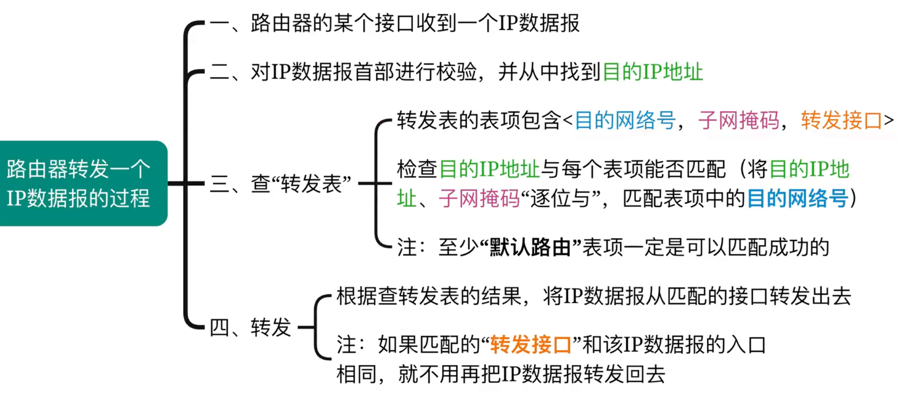

# 网络层

## 网络层的功能
异构网络互联：
- “异构”：每个网络的拓扑结构不同、物理层&链路层的实现不同、主机类型也各不相同
- 重要设备：`路由器（Router）`，在TCP/IP文献中也称为`网关（Gateway）`

路由与转发：
- 路由：`多个路由器间相互配合`，规划IP数据报（分组）的最佳转发路径（注：各个路由器之间运行`路由协议`，生成各自的`路由表`）
- 转发：`一台路由器`，根据自己的`转发表`，将收到的IP数据报（分组）从合适的接口转发出去（注：转发表=精简版路由表，有利于快速检索）

拥塞控制：

**⚠️一些概念和错题知识点整理** 
- 在`路由器`互联的多个局域网的结构中，`要求每个局域网物理层、数据链路层、网络层协议可以不同`（连接IPv4或IPv6的网络），而`网络层以上的高层协议必须相同`
- 在因特网中，IP分组的传输需要经过源主机和中间路由器到达目的主机，通常`源主机和中间路由器都不知道IP分组到达目的主机需要经过的完整路径`
- `流量控制`和`拥塞控制`的区别：`流量控制是抑制发送方的的速率，拥塞控制是全局性的`，涉及网络中所有的主机

---

## IPV4
### IPV4分组
IP数据报（IP分组）的格式：

`首部长度以4B为单位`，最大为60B 
`总长度以1B为单位` 

真题中会给图，首部格式不用记忆：

`以太网MAC帧记忆口诀：6 6 2 N 4，收发协数验（N为46~1500）` 
重要概念：一个链路层数据帧能承载最大数据量称为最大传送单元`MTU`，以太网中为1500B 
如果`一个IP数据报的总长度超出了下一段链路的MTU，就需要分片` 

`标识`字段作用：如果数据接收方收到好几个标识相同的IP数据报分片，说明他们来自同一个数据报，接收方需要将他们重新组装成原来的数据报 

`标志`字段作用：`最低位MF（More Fragment）`、`次低位DF（Don't Fragment）` 
- MF=1，表示后面还有分片，MF=0表示最后一个分片
- DF=1，表示该数据报不允许分片，DF=0表示允许分片 
如果路由器想要将一个不允许分片的IP数据报发送给下一个节点，但是下一段链路的MTU小于该数据报的长度，那么路由器必须丢弃该数据报，向源主机发送一个`ICMP`差错报文，告诉源主机`数据报太长` 

IP数据报分片：

注意：`片偏移以8B为单位`

`生存时间`：`TTL`，数据报在网络中可通过的路由器的最大值。每经过一个路由器，TTL减1，当TTL为0时，路由器丢弃该数据报，并向源主机发送一个`ICMP`差错报文，告诉源主机`TTL超时` 
`协议`：TCP、UDP等 
`首部校验和`：每个路由器仅校验首部，不校验数据部分，如果该字段设为全0，则表示不校验（方法与UDP相同） 

总结：

### IP地址
单播地址、多播地址： 

上图记住A类地址、B类地址、C类地址他们的组成（网络号分别占8、16、24bit） 

32bit的IP地址组成：<网络号> + <主机号> 

- 在那个年代，要求每台主机、每个路由器接口被分配的IP地址是全球唯一的
- 路由器和路由器连接的接口可以不分配IP地址，但路由器和其他节点的接口必须分配IP地址
- 从属于`同一个网络`的所有主机、路由器接口的IP地址`”网络号“都相同`
- 当一台`新主机接入网络时`，需要给它`分配一个IP地址`，并配置一个`默认网关`（让主机知道将数据传给互联网需要通过哪一个接口）

路由器的转发表：目的网络号和转发接口 
通过ARP协议知道同一个网络内的路由器、主机的IP地址对应的MAC地址 
在发送IP数据报的过程中，IP数据报的源地址和目的地址都是没有变的，但是它封装成帧后的帧MAC地址每一跳都会变 
从属于同一网络（网络号一致）的主机间的IP数据报的转发是不需要发给默认网关的 
王道的两个例子：转发给本网络，转发给其他网络

一些特殊用途的IP地址：
网络号为Y，主机号全为0：表示一个网络本身，如192.168.1.0 
网络号为Y，主机号全为1：表示向网络号为Y的网络广播IP分组，只能用于目的地址，如192.168.1.255 
网络号全为0，主机号非全Y：表示本网络中的主机号为Y的主机，只能做源地址，如0.0.0.1 
网络号和主机号全为0：表示本网络上的本主机，只能做源地址，0.0.0.0（当主机刚接入网络中，没有IP地址时使用） 
网络号和主机号全为1：向本网络广播IP分组，只能用于目的地址，255.255.255.255 
网络号为127，主机号非全0或非全1：环回自检地址，127.0.0.1 

### 子网划分与子网掩码

王道的几个训练：同一子网下的主机间、同一路由器下的不同子网间、使用子网划分技术和不使用子网划分技术的路由器下的主机间、主机给互联网发送数据报 
如果是同一子网下的主机间，主机对比源地址和目的地址与子网掩码相与的结果一致，就直接发送给目的主机，不需要经过默认网关

如果是不同子网下就需要转发给默认网关了，路由器根据目的地址与不同子网掩码相与的结果，转发给对应的接口

如果是主机给互联网发送数据报，使用默认路由0.0.0.0，一定可以匹配上

总结：
1. 主机发送IP数据报的过程：

2. 路由器转发IP数据报的过程

