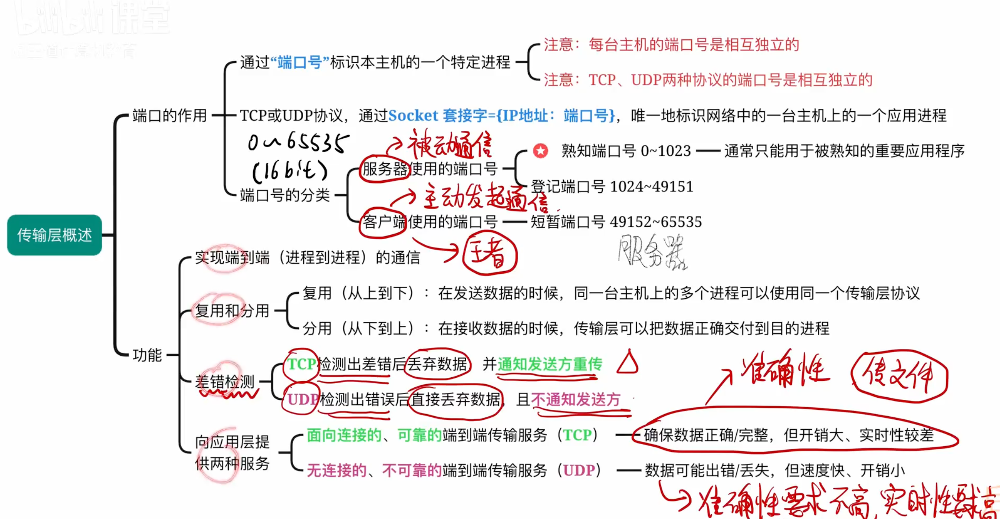
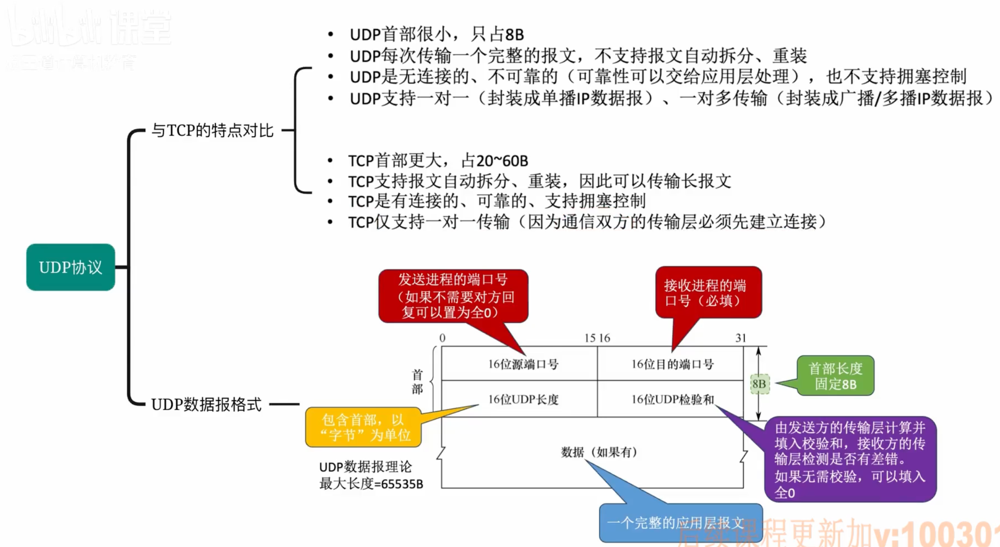

# 传输层

## 传输层提供的服务

一些特殊应用程序的端口号：
- FTP：20、21
- TELNET：23
- SMTP：25
- DNS：53
- TFTP：69
- HTTP：80
- SNMP：161

## UDP协议
### UDP数据报
UDP数据报理论最大长度是65535字节，但是实际应用中，由于IP数据报的限制，UDP数据报的长度不能超过65515字节，因为IP数据报的长度限制是65535字节，而IP数据报首部长度为20字节，所以UDP数据报的最大长度为65535-20=65515字节。

UDP数据报首部格式：源端口、目的端口、长度、检验和

### UDP检验
