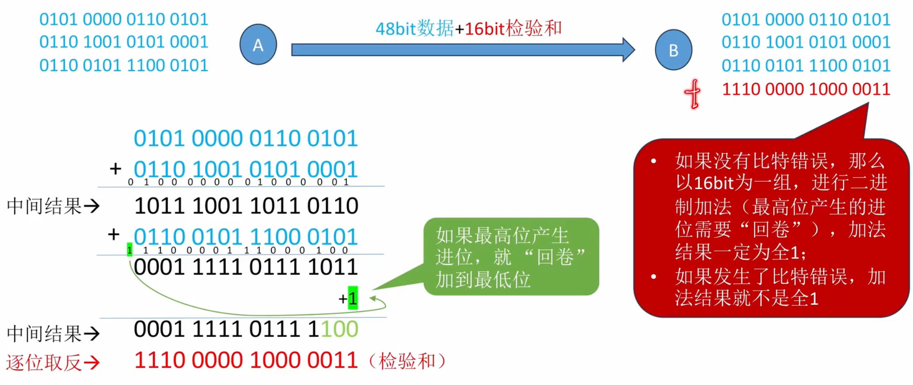
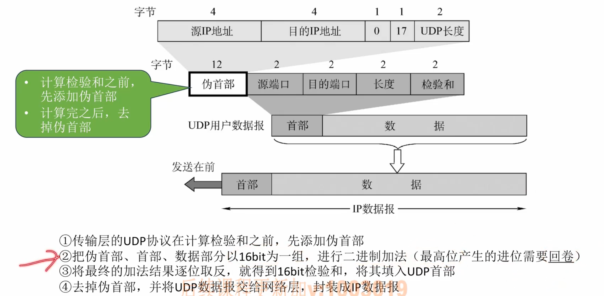
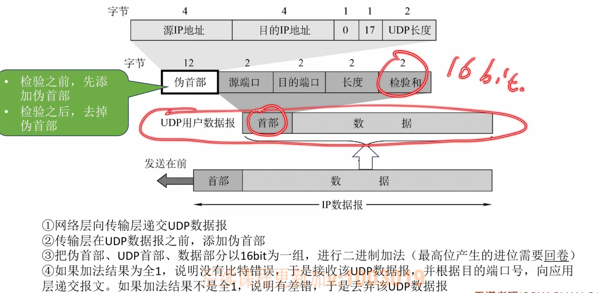
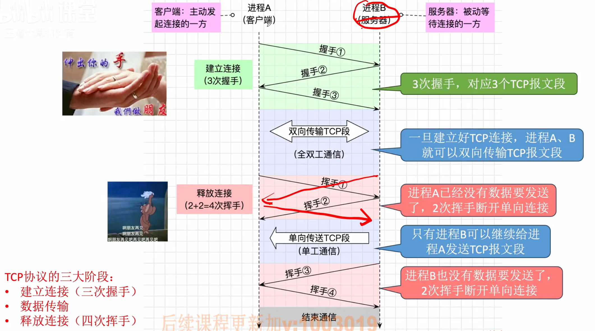
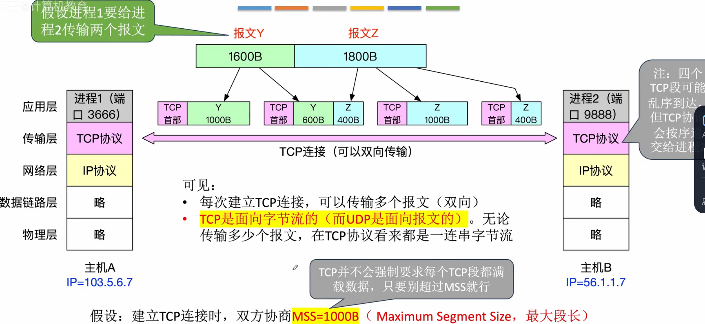
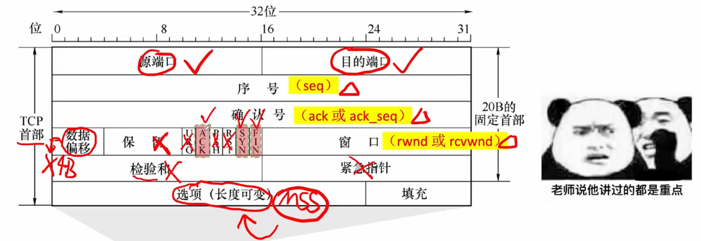
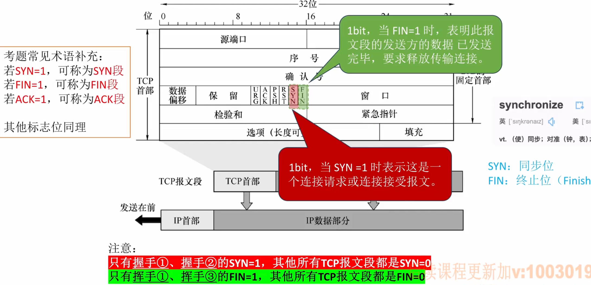
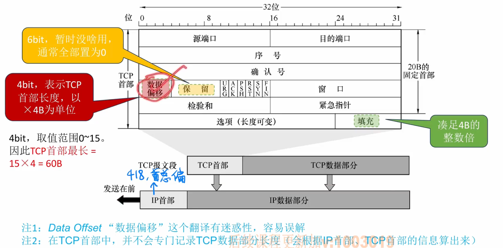
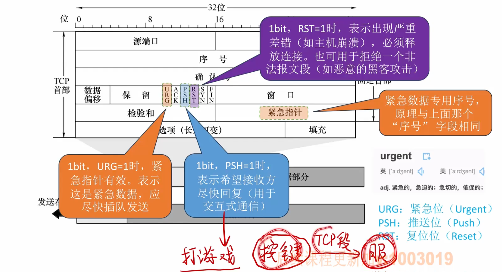
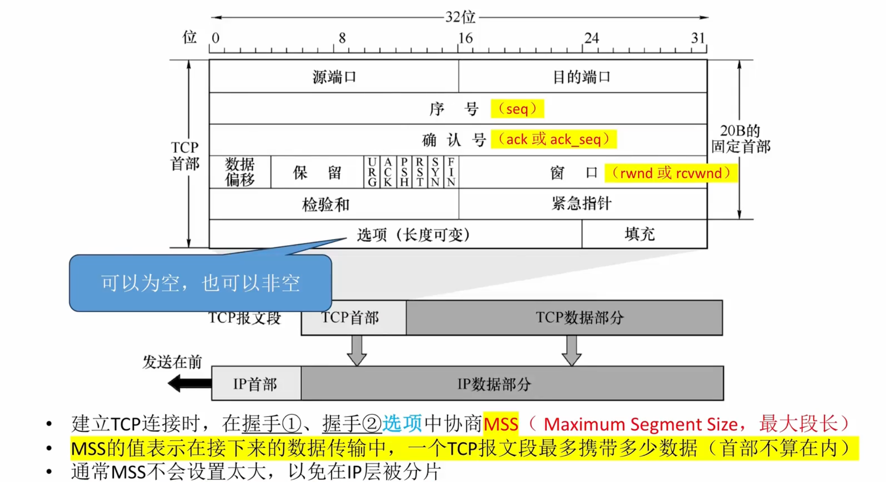

# 传输层

## 传输层提供的服务

一些特殊应用程序的端口号：FTP：20、21，TELNET：23，SMTP：25，DNS：53，TFTP：69，HTTP：80，SNMP：161

## UDP协议
### UDP数据报
UDP数据报理论最大长度是65535字节，但是实际应用中，由于IP数据报的限制，UDP数据报的长度不能超过65515字节，因为IP数据报的长度限制是65535字节，而IP数据报首部长度为20字节，所以UDP数据报的最大长度为65535-20=65515字节。

UDP数据报首部格式：源端口、目的端口、长度、检验和（均为2字节）

### UDP检验
一种新的差错检验方法：将数据部分以16bit为一组进行二进制加和，中间结果如果最高位有进位就回卷加到最低位，得到结果逐位取反就是校验和 
检验：将接收到的内容以16bit为一组进行二进制加和，中间结果如果最高位有进位就回卷加到最低位，如果加法结果全1没有差错，如果不是全1有差错 

例子：

UDP检验（发送方）：

UDP检验（接收方）：

在IP数据报的首部有首部校验和，他只需要对IP数据报首部进行二进制加和（最高位进位回卷到最低位）、取反计算，不需要添加伪首部

## TCP协议
### TCP协议的框架梳理
TCP报文段（TCP段）：TCP首部+TCP数据 
由于TCP协议支持报文拆分、重装，因此应用层的报文较长也是可以的

建立连接（三次握手）是客服端发起连接，而释放连接（四次挥手）可以是客户端发起，也可以是服务器发起

TCP是面向字节流的，可以双向传输，TCP段的数据长度不超过MSS（最大段长）就行

### TCP报文段⭐️⭐️⭐️

最重要的6个字段：`序号（seq）`、`确认号（ack或ack_seq）`、`窗口（rwnd或rcvwnd）`、`ACK`、`SYN`、`FIN` 
序号（seq）：用于标记数据部分第一个字节在原始字节流中的位置（注意起始序号是发送发自己设的不一定从0开始） 
确认号（ack或ack_seq）：用于反馈，表示序号在该确认号之前的所有字节都已正确收到（累计确认，例如ack=2500表示2500序号所有字节都收到了） 
ACK：1bit，表示确认号（ack）字段是否有效，只有握手①的ACK=0，其他所有TCP报文段ACK=1 
窗口（rwnd或rcvwnd）：16bit，表示接收窗口的大小，即从本报文段首部中的确认号算起，接收方还有多大的缓冲区可以用于接收数据，是实现流量控制的关键（例如在接收方缓冲区有2500B，在接收了两个1000B的报文段后，缓冲区只有500B了，这时接受方给发送方返回的报文段就有rcvwnd=500这个信息） 
SYN和FIN：

其余字段：

数据偏移：4bit，表示TCP首部长度，以4B为单位，因此TCP首部最大长度为60B（没有TCP数据部分长度的字段，`IP数据报总长度` - `IP数据报首部长度` - `TCP首部长度` = `TCP数据部分长度`） 
URG、PSH、RST、紧急指针：

校验和：原理与UDP雷同，计算检验和之前也需要添加12B伪首部（只需将UDP伪首部的协议字段的17改成6，UDP长度字段改成TCP长度） 
选项字段本身不重要，但是可以用来协商MSS（最大段长）很重要 

### TCP连接管理（三次握手、四次挥手）⭐️⭐️⭐️
