# 应用层

## 应用层介绍

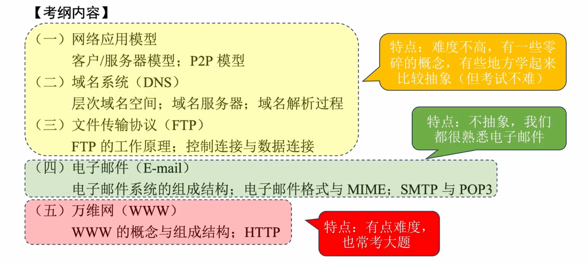

## 网络应用模型
C/S模型：客户端/服务器模型
P2P模型：对等模型

## 域名系统DNS
顶级域名 -> 如com、cn、net、org
二级域名 -> 如baidu.com、qq.com、com.cn
三级域名 -> 如www.baidu.com、www.qq.com

根域名服务器（.）
顶级域名服务器（.com）
授权/权限域名服务器（baidu.com）
本地域名服务器（带代替你问域名服务器得到域名对应地址）

高速缓存：提高查询效率，会在一段时间后丢弃高速缓存中的信息

递归查询：（本地域名帮你问根，根在继续向下问）

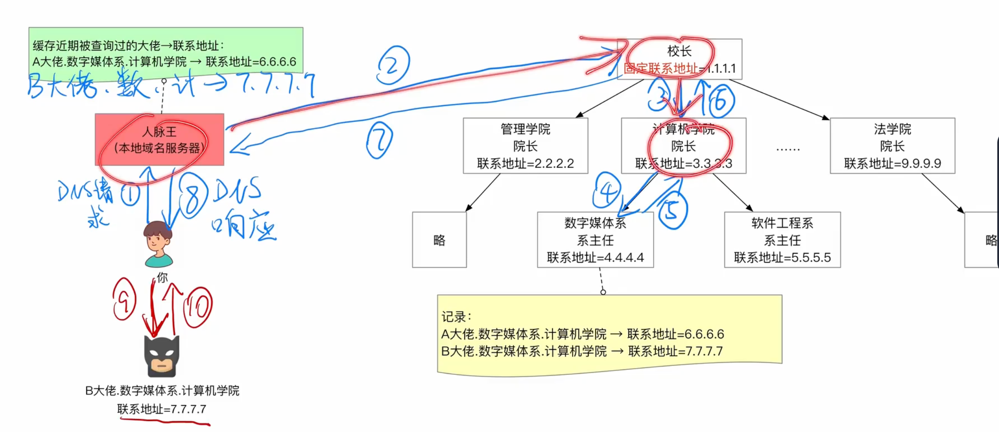

迭代查询：（本地域名一层一层问）

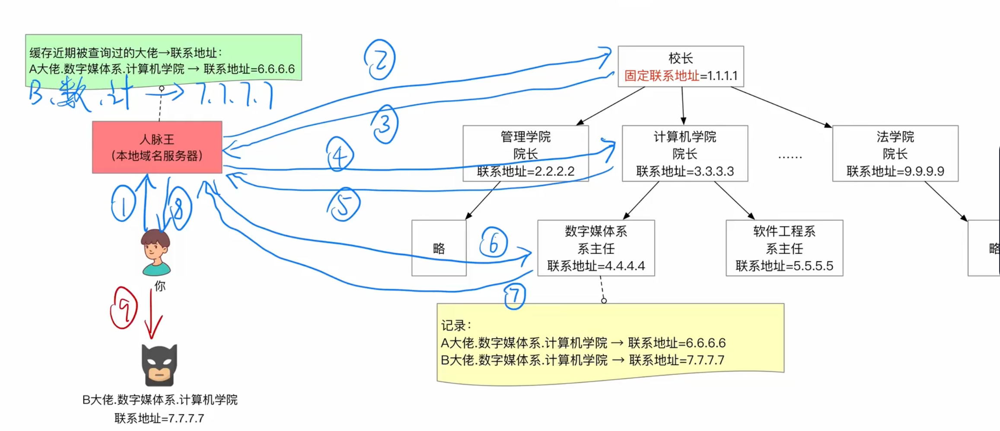

## 文件传送协议FTP
FTP是基于客户/服务器模式的协议 
FTP的客户端和服务器端之间会建立两个并行的TCP连接
- 控制连接始终保持（连接端口21）
- 数据连接保持一会
  - 主动方式使用20端口
  - 被动方式自行协商（端口>1024）

## 电子邮件
电子邮件是一种异步通信方式，为什么？ 
因为电子邮件发送方和接收方不需要同时在线，只需要在发送邮件时在线即可

发送接收过程：

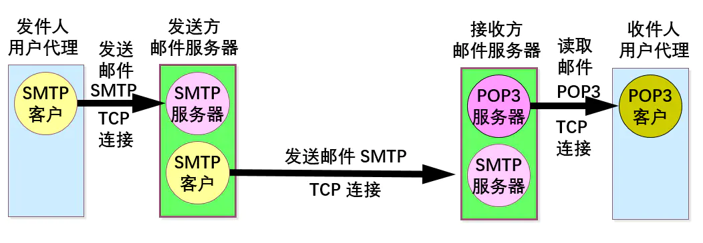

简单邮件传送协议SMTP：TCP连接、端口号25，只能传送7位ASCII码不能传中文等

MIME：多用途因特网邮件扩展，可以传送非ASCII码的邮件

邮局协议POP3：TCP连接、端口号110 
两种工作方式：下载并保留在服务器、下载并删除

网际报文协议IMAP：可以先看正文，打开某个邮件才下载

基于万维网的电子邮件：HTTP协议

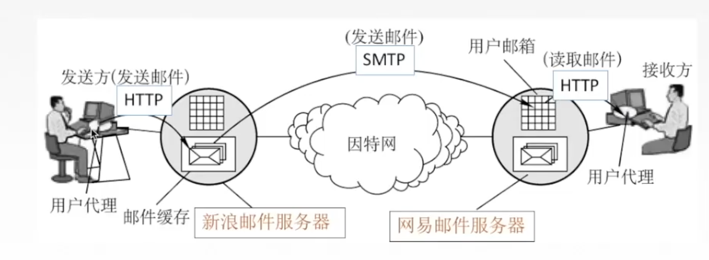

## 万维网WWW
大杂烩之访问一个网页发生了什么？

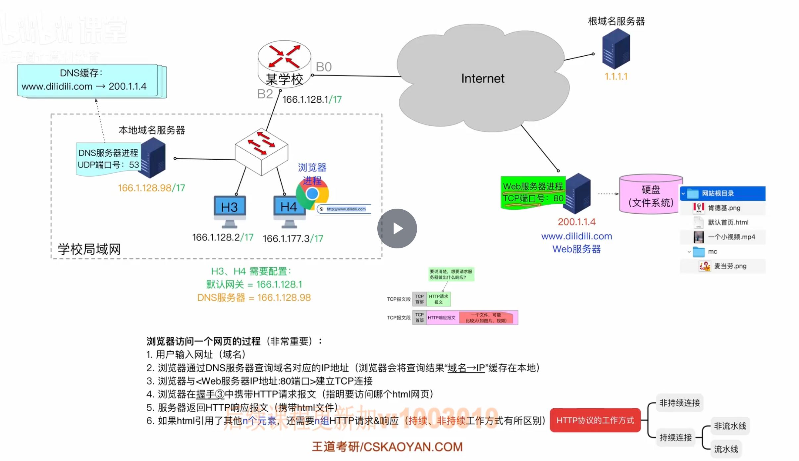

非持续连接方式：

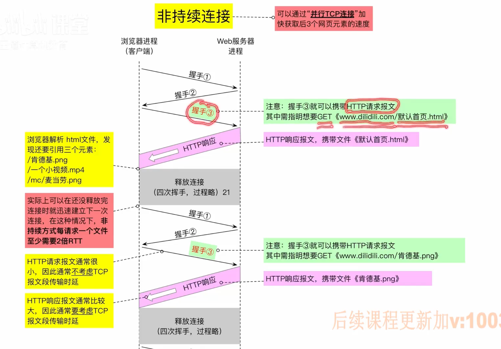

持续连接，非流水线方式：

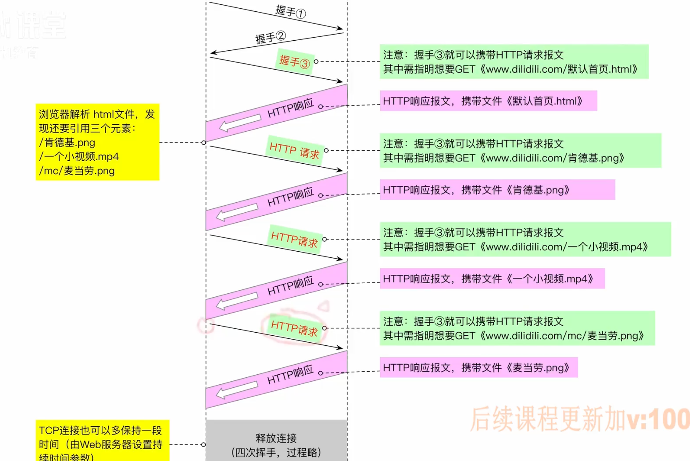

流水线方式：

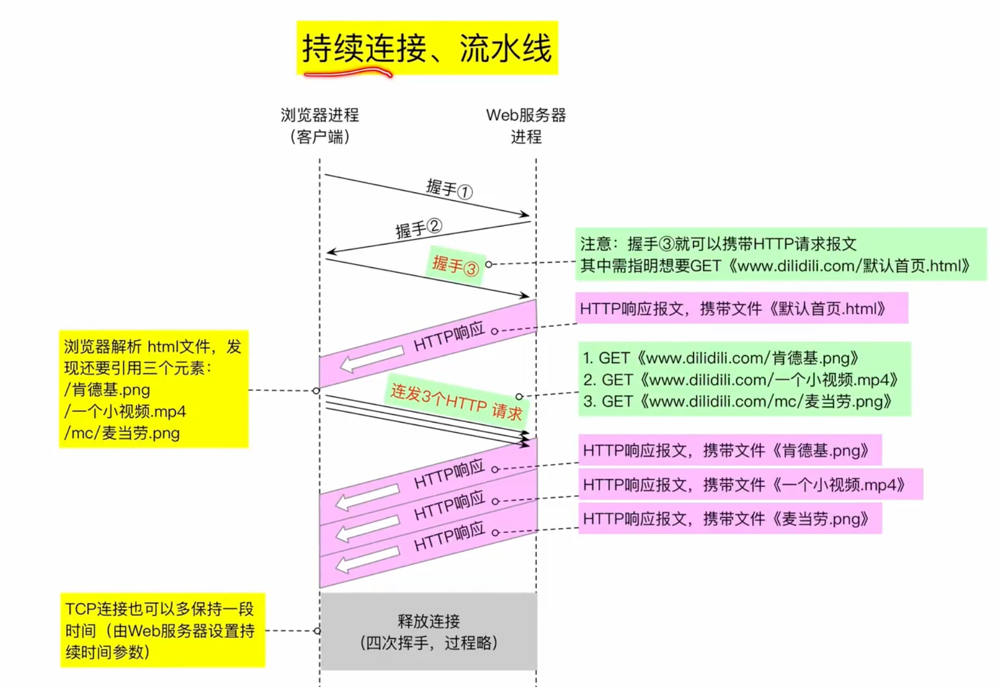

## 超文本传输协议HTTP
HTTP1.0默认使用非持续连接，HTTP1.1默认使用持续连接 

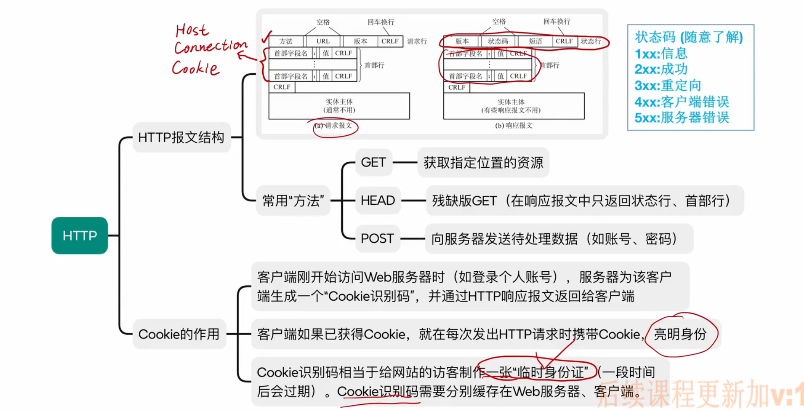

例题：

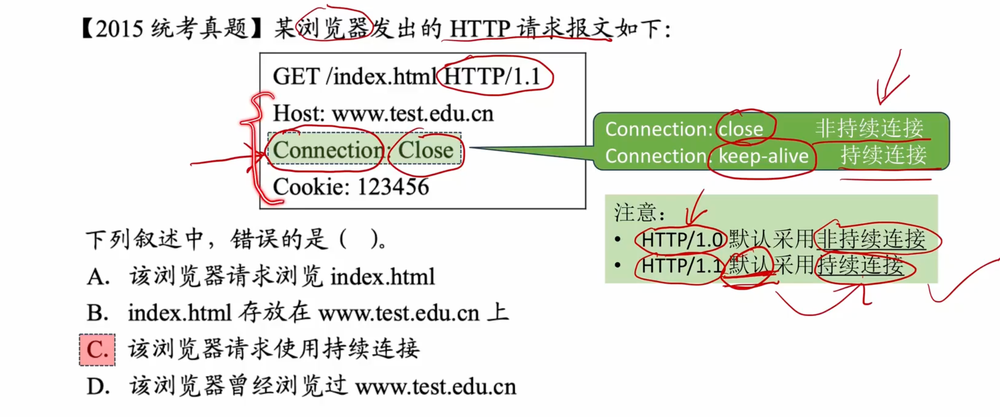

